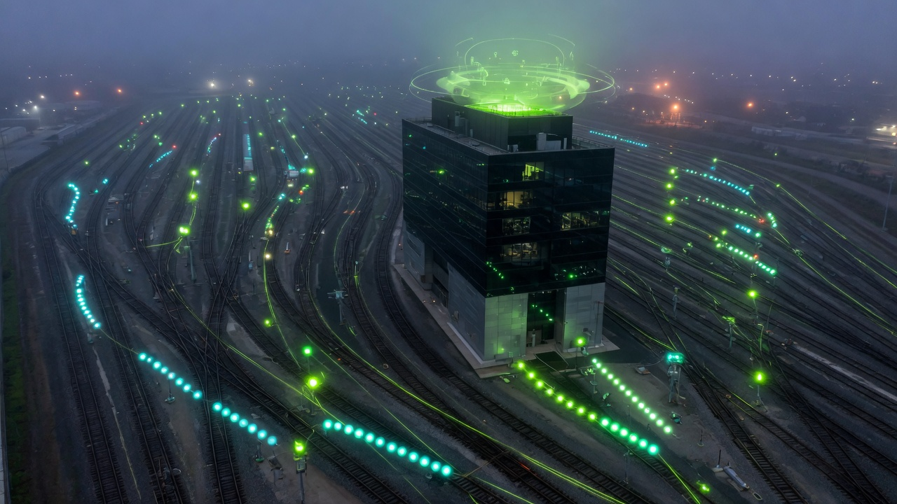

<p align="center">
  
</p>

# Nemotron Switchyard Studio

<p align="center">
  <strong>Fine-tune a small specialist. Route every incoming query through Switchyard.</strong><br/>
  Open models for the <a href="https://developer.nvidia.com/gtc-golden-ticket-contest">NVIDIA GTC Berlin Golden Ticket</a> · #NVIDIAGTC
</p>

**Decision in one line:** plan on a frontier Nemotron, execute on a *fine-tuned* Lightning-class specialist, keep restricted data local — and make that routing a visual, not a comment in app code.

## What this is


1. **A web UI to fine-tune a small model** with the Nemotron Lightning SFT recipe (assistant-only LoRA, frozen test, rank-8).
2. **A live visual of how [NeMo Switchyard](https://github.com/NVIDIA-NeMo/Switchyard) throws incoming queries** onto three tracks.

```text
  Claude / curl / your agent
              │  one prompt
              ▼
     ┌─────────────────────┐
     │     SWITCHYARD      │  classify · throw the switch
     └─────────┬───────────┘
        ┌──────┼────────┐
        ▼      ▼        ▼
   Frontier  Lightning  Local
   Ultra     SFT / NIM  adapter
   (plan)    (execute)  (PII)
```

| Track | When | Backend |
|-------|------|---------|
| **Frontier** | Plan, architecture, hard verify | Nemotron Ultra / Lightning *thinking on* via [NIM](https://build.nvidia.com/nvidia/nemotron-3.5-lightning-30b-a3b) |
| **Lightning** | Tickets, tools, JSON, volume | Fine-tuned student, else Lightning NIM *thinking off* |
| **Local** | SSN, PCI, “stay local” | Never leaves this machine |

## Quick start

```bash
git clone https://github.com/cobusgreyling/nemotron-switchyard-studio.git
cd nemotron-switchyard-studio
cp .env.example .env   # set NVIDIA_API_KEY from https://build.nvidia.com
chmod +x run.sh
./run.sh
# → http://127.0.0.1:7878
```

Three tabs:

| Tab | What you do |
|-----|-------------|
| **Switchyard** | Type a query (or click a chip). Watch the packet ride the rails. |
| **Fine-tune** | LoRA SFT on 8 DeskCard tickets. MPS/CUDA/CPU. |
| **Before / after** | Frozen test: stock student vs LoRA vs NIM Lightning. |

## Honest hardware notes

- **NIM cannot train.** [build.nvidia.com](https://build.nvidia.com/nvidia/nemotron-3.5-lightning-30b-a3b) is the hosted Lightning endpoint — used here as the *before* baseline and as the live execute/plan model.
- **Nemotron 3.5 Lightning is 30B MoE (~3B active).** This Mac cannot load it for LoRA. The Fine-tune tab trains a **small student** with the *same* mask and card contract:
  - default `Qwen/Qwen2.5-0.5B-Instruct` (fits 16 GB unified memory, ~2–4 min on Apple MPS)
  - optional `nvidia/Nemotron-Research-Reasoning-Qwen-1.5B` (actual Nemotron small model; first run downloads ~3 GB)
- Production Lightning SFT: NeMo AutoModel / Megatron-Bridge on H100s, or Colab A100. Same recipe.

## Why Switchyard in front of SFT

After you specialize the execute model, the *optimal split moves*. Plans still need a frontier. Tool calls should not. Restricted data must never hit the hosted NIM. Switchyard makes that a library / proxy concern instead of `if step == plan` in every harness.

This studio’s classifier is educational (keyword + score). Production traffic should use official [`switchyard-server`](https://github.com/NVIDIA-NeMo/Switchyard) and a `routes.toml` — see [switchyard-resource-kit](https://github.com/cobusgreyling/switchyard-resource-kit).

## Layout

```
.
├── app.py                 FastAPI lab
├── src/{dataset,router,train,nim,evaluate}.py
├── static/                Switchyard visual + fine-tune UI
├── assets/header.jpg
└── outputs/lora-sft/      adapter after you train
```

## License

MIT for this kit. Nemotron weights / NIM: NVIDIA licenses (OpenMDW-1.1, API trial ToS). Not an official NVIDIA product page.
